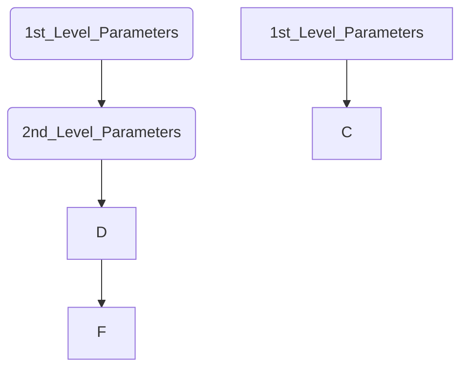

### Description of workflow and code files

#### Files:
1. DCM inversion:  ...
2. PEB estimation:  ...
3. Normative use case: ...

Workflow chart:

---

#### Details:
##### 1. DCM inversion for the CMCs (1st level):
- ...
---

##### 2. Parameter optimisation with PEB (2nd level):
- ...
---
  
##### 3. Use case for normative CMC priors: 
- ...
